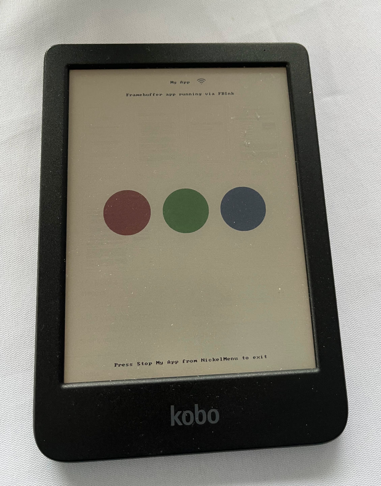

# "Hello World" Custom App on Kobo Clara Colour

A simple framebuffer application for the Kobo Clara Colour.



## Supported Firmware/Device

- **Device:** Kobo Clara Colour
- **Firmware:** This application is developed based on the information available for Kobo devices, but has not been tested on a specific firmware version. NickelMenu is required, and its compatibility with the device firmware should be checked.

## Build Instructions

This project uses a Docker-based build environment.

1.  **Prerequisites:** Docker must be installed on your system.

2.  **Build the build environment image:**
    ```sh
    docker build -t kobo-app-buildenv .
    ```

3.  **Build the application:**
    Run the following command from your project root to compile the application:
    ```sh
    docker run --rm -v "$(pwd)":/work kobo-app-buildenv
    ```
    This will create a `myapp` executable in the `build/` directory.

4.  **Prepare the application files for deployment:**
    Create a `dist` directory:
    ```sh
    mkdir -p dist/lib
    ```
    Copy the application executable and scripts:
    ```sh
    cp build/myapp scripts/run.sh scripts/stop.sh dist/
    ```
    Extract the FBInk library from the build environment image:
    ```sh
    docker run --rm kobo-app-buildenv sh -c 'cd /opt/FBInk/Release && tar -c libfbink.so*' | tar -x -C dist/lib
    ```

## Install Instructions

1.  **Connect your Kobo** to your computer.

2.  **Install NickelMenu:** If you don't have it installed, follow the instructions on the [NickelMenu website](https://pgaskin.net/NickelMenu/).

3.  **Create the application directory:**
    Create the directory `/mnt/onboard/.adds/myapp` on your Kobo's internal storage. In your file explorer, this will appear as `.adds/myapp` in the root of the Kobo eReader's storage.

4.  **Copy the application files:**
    Copy the contents of the `dist` directory (`myapp`, `run.sh`, `stop.sh`, and the `lib` directory) to the `.adds/myapp` directory on your Kobo.

    The final structure on the Kobo should be:
    ```
    .adds/
      myapp/
        run.sh
        stop.sh
        myapp
        lib/
          libfbink.so
          libfbink.so.1
          libfbink.so.1.0.0
    ```

5.  **Make scripts executable:**
    You may need to ensure `run.sh` and `stop.sh` are executable. If you have shell access to your Kobo, you can run:
    ```sh
    chmod +x /mnt/onboard/.adds/myapp/run.sh
    chmod +x /mnt/onboard/.adds/myapp/stop.sh
    ```

6.  **Configure NickelMenu:**
    Add the following lines to your NickelMenu configuration file, which is located at `.adds/nm/config` on your Kobo:
    ```ini
    menu_item :main :My App :cmd_spawn :quiet:/mnt/onboard/.adds/myapp/run.sh
    menu_item :main :Stop My App :cmd_spawn :quiet:/mnt/onboard/.adds/myapp/stop.sh
    ```

7.  **Eject your Kobo** and restart it. You should now see "My App" in the main menu.

## Uninstall Instructions

1.  **Connect your Kobo** to your computer.

2.  **Remove the application directory:**
    Delete the `.adds/myapp` directory from your Kobo's internal storage.

3.  **Remove the NickelMenu configuration:**
    Edit the `.adds/nm/config` file and remove the two `menu_item` lines you added for this application.

4.  **Eject your Kobo** and restart it.

## Known Risks

- This application writes directly to the framebuffer. While it is designed to be safe, bugs could potentially cause display issues that require a reboot.
- The application is designed not to modify any system files, but any custom application carries a small risk of unforeseen interactions with the Kobo system software.
- Ensure NickelMenu is compatible with your firmware version.

## Touch-Device Discovery Notes

This initial version of the application does not handle touch input. Future versions will need to discover the correct touch input device (e.g., `/dev/input/event1`). This can be done by inspecting `/proc/bus/input/devices` or the contents of `/sys/class/input/event*/device/name`. The `KOBO_TOUCH_DEVICE` environment variable can be used to manually specify the touch device.

## Licensing Notes for FBInk

This application uses the [FBInk](https://github.com/NiLuJe/FBInk) library, which is licensed under the **GPLv3+**. This means that if you distribute this application, you must do so under the terms of the GPLv3 or a later version. This includes making the source code available.
